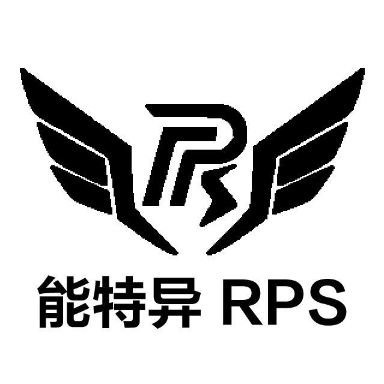

<div align="center">

# RPS 2025 Radar

> 2025年中国石油大学(华东)RPS战队 RoboMaster超级对抗赛 雷达代码
> 
> PC_First_Net 分支为点云当作第一层网络处理;PC_Positioning 分支为点云只用作定位

<p align="center">
  
</p>

</div>

<br>

--------

<br>

<div align="left">


## 硬件条件

- 激光雷达 Livox Avia + Livox Mid70
- 海康相机 Hik CS050 + Hik CA016

## 项目结构说明

```
.
├─ livox                    //相机-激光雷达联合标定rosbag
├─ livox_preprocessed       //相机-激光雷达联合标定结果
│
├─ resource
│  ├─ lidar2world.txt       //激光雷达外参
│  ├─ main2world.txt        //主相机外参
│  ├─ sec2world&rect.txt    //副相机外参及飞镖舱门位置
│  ├─ debug.txt             //串口debug信息
│  ├─ map_25_national.jpg   //地图jpg文件
│  ├─ RM2025_national.pcd   //地图pcd文件
│  └─ ... 
│
├─ src
│  ├─ fusion       
│  │  └─kalman_filter       //点云聚类跟踪及数据融合(核心)
│  │
│  ├─ interfaces            //自定义消息接口
│  │
│  ├─ lidar
│  │  ├─ cluster            //点云聚类(弃用)
│  │  ├─ dynamic_cloud      //点云背景过滤
│  │  └─ lidar_registration //激光雷达外参标定
│  │
│  ├─ radar_bringup         //配置文件及launch文件
│  │
│  ├─ RPS_Radar24
│  │  ├─ model              //onnx及trt文件
│  │  ├─ src
│  │  │  ├─ ByteTrack       //轨迹跟踪相关
│  │  │  ├─ Camera_hk       //相机驱动相关
│  │  │  ├─ General         //通用工具
│  │  │  ├─ Hero            //英雄辅助吊射(弃用)
│  │  │  ├─ Image           //图像相关
│  │  │  ├─ Locate          //定位相关
│  │  │  ├─ Net             //网络相关
│  │  │  ├─ Port            //串口相关
│  │  │  ├─ Radar           
│  │  │  │  ├─ src          //主函数相关(核心)
│  │  │  │  └─ ...
│  │  │  │
│  │  │  └─ ...
│  │  │
│  │  └─ ...
│  │
│  └─ utils        
│     ├─ calib_multi_lidar  //多激光雷达联合标定
│     ├─ direct_visual_lidar_calibration 
│     │                     //相机-激光雷达联合标定
│     ├─ prepare_calib_cam_lidar      
│     │                     //录制相机-激光雷达联合标定rosbag
│     ├─ show_calib_cam_lidar
│     │                     //显示相机-激光雷达联合标定效果
│     ├─ find_files.py      //找最新log文件
│     └─ log_filter.py      //找log文件特定字段
│
├─ scripts                  
│  ├─ calib_lidar_cam.txt   //相机-激光雷达联合标定相关命令
│  ├─ ColconBuild.sh        //编译
│  ├─ OpenMVS.sh            //启动MVS
│  ├─ Startup.sh            //启动全部
│  ├─ Startup_cam.sh        //启动相机部分
│  ├─ Startup_foxglove.sh   //启动foxglove
│  └─ Startup_lidar.sh      //启动激光雷达部分
│
└─ ...

```
## 部署

```
按照环境配置文件安装相关环境
更改代码中的绝对路径
./ColconBuild.sh #一键编译脚本，单节点编译
```

## 运行
- 更改[src/main.cpp](src/RPS_Radar24/src/Radar/src/main.cpp)中红蓝方参数
- Startup.sh 启动全部程序，并进行标定
- 初次标定完成后，更改[Config.yaml](src/radar_bringup/config/Config.yaml)中的cam_use_saved_T为true,
[default.yaml](src/radar_bringup/config/default.yaml)中的use_saved_T为true,本分支PC_Positioning更改了ros2
的配置文件加载方式,因此更改yaml文件后不需要重新编译,直接运行Startup.sh即可


## TODO
- 主/副相机存在突然不取流的问题，需要更换相机/相机线/相机驱动
- 第二层网络存在死车误识别、敌方堡垒处误识别的问题，优化第二层网络，可以考虑三层网络识别(增加死车识别)/换高分辨率相机
- 存在误跟踪的情况，可以考虑学习港科的方案

</div>
